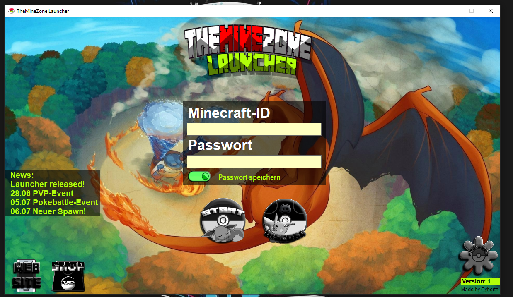

# Minecraft Launcher 👾
Custom launcher for minecraft modded servers

## Table of content
- [Features](#Features)
- [Installation](#Installation)
- [Preview](#preview)
- [Stats](#stats)
- [Clone](#clone)
- [License](#License)

## Features🚦
-News
-works with mojang api
-save passwords (currently weak encryption!!!)
-automatic updates through server

## Installation💻
Requirements for the client are:
-Windows
-Java

for the server you can choose mac, linux or windows

## Preview🎈


## Stats📊


## Clone🔄
> You need at least Visual Studio 2019

- Enter the following command
  
  ```shell
  $ git clone https://github.com/CodingTarik/Minecraft-Mod-Launche.git
  ```
  
## License📜


